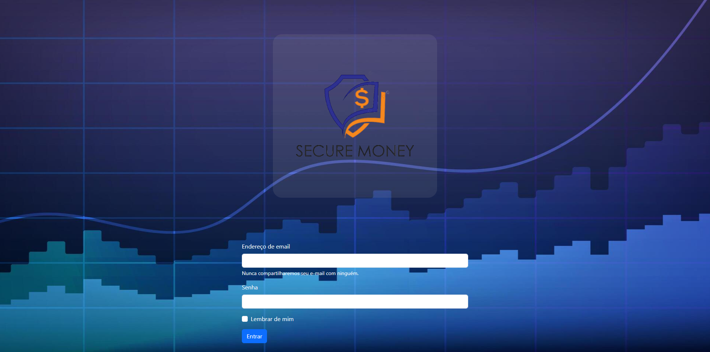

# Página de Login – HTML, CSS e Bootstrap

Este repositório contém uma **página de login responsiva** desenvolvida com **HTML, CSS e Bootstrap**. O objetivo do projeto é praticar estruturação de layout, formulários e responsividade utilizando os recursos do Bootstrap.

---

## 🚀 Tecnologias Utilizadas
- **HTML5**
- **CSS3**
- **Bootstrap 5**

---

## 🎨 Funcionalidades
- Layout totalmente responsivo
- Formulário de login estilizado
- Campos de usuário e senha
- Botão de acesso
- Design moderno utilizando classes do Bootstrap

---

## 📷 Preview do Projeto
```md

```

---

## 📁 Estrutura do Projeto
```
/
├── public
│ ├── assets
│ │ └── images
│ │ ├── fundo.jpg
│ │ |── logomarca.png
| | └── preview.png
│ ├── css
│ │ └── style.css
│ └── index.html
└── README.md
---

## 🔗 Links Importantes
- [Repositório GitHub:](https://github.com/diegoddn/pagina-de-login)
- [Deploy na Vercel:](https://pagina-de-login-cyan-chi.vercel.app/)

---

## ▶️ Como Usar
Clone o repositório:
```bash
git clone https://github.com/diegoddn/pagina-de-login.git
```

Abra o arquivo **index.html** em qualquer navegador para visualizar o projeto.

---

## 📄 Licença
Este projeto está disponível para uso livre para fins de estudo e aprendizado.
